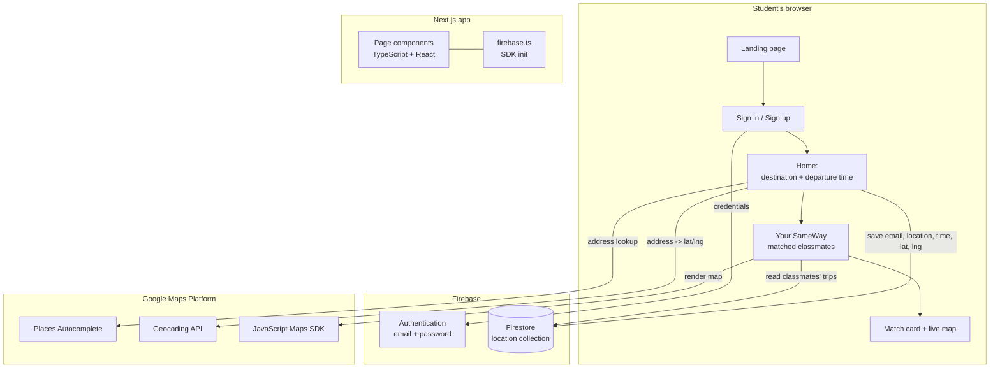

<div align="center">


### 🚶 Walk home together.

**SameWay connects students with verified classmates heading the same way at the same time — so nobody has to walk home alone.**

[](https://nextjs.org/)
[](https://react.dev/)
[](https://www.typescriptlang.org/)
[](https://firebase.google.com/)
[](https://developers.google.com/maps)
[](https://getbootstrap.com/)

[](#project-status)
[](#)
[](https://csc-back-to-school.devpost.com/)

[The pitch](#the-30-second-pitch) · [What it does](#what-sameway-does) · [How it works](#how-it-works) · [Tech](#tech-stack) · [Run it](#getting-started) · [Demo flow](#demo-flow)

</div>

---

## 🎤 The 30-second pitch

> Students walk home alone every night and feel unsafe. Rideshares cost too much. Walking alone is dangerous. **SameWay connects verified classmates going the same way at the same time — so they walk together. Live map. SOS button. School email verification. Free. Every student deserves to get home safe.**

---

## 🌙 The problem

It's 9 PM. A student leaves the library alone. They're scared — recent attacks, no money for Uber, no one to walk with.

Walking home alone at night is one of the most common and most avoidable safety risks students face. Rideshares are expensive and not always available, and conventional "safety" apps call for help *after* something goes wrong. What's missing is the simplest thing of all: **someone to walk with**.

## 🎓 The person

This is **Maya**. She's 16. She walks home alone three nights a week.

SameWay is built for Maya — not for a statistic. Every design decision starts from one question: *would this make Maya feel safer on her walk home tonight?*

## 💡 The solution

**SameWay connects her with a verified classmate going the same way at the same time.** Same route. Same time. Safe together.

A student signs in with their school email, enters where they're heading and when they're leaving, and SameWay shows the classmates nearby who are leaving around the same time. One tap to reach out — then they walk together.

## 📱 The proof

Watch it work, end to end:

1. 🔑 **Maya logs in** with her school email.
2. 📍 She enters **"Main St Station"** as her destination and picks a departure time.
3. 🤝 SameWay geocodes the destination and shows **classmates heading the same way within the same hour**, sorted by how close their destinations are.
4. 🗺️ Each match appears as a **card with a live map** centered on that classmate's destination.
5. 💬 She taps **"Connect on SameWay"** and sends a request.
6. 🚶 Accepted — they walk together.

## ❤️ The impact

**Every student deserves to get home safe.** SameWay makes that possible — for free, with the classmates they already know.

---

## ✨ What SameWay does

| Feature | What it does |
| --- | --- |
| 🎓 **School email sign-up / sign-in** | Firebase Authentication. Only recognized school addresses are admitted (configurable per school). |
| 📍 **Destination + departure time** | Google Places Autocomplete for the destination, plus a 15-minute step time picker. |
| 🗺️ **Automatic geocoding** | Turns a free-text destination into precise `lat` / `lng` via the Google Geocoding API. |
| 🤝 **Same-way matching** | Reads classmates' saved trips and keeps those whose departure hour is within ±1 hour of yours. |
| 📏 **Distance-aware ranking** | Ranks matches by Haversine distance and shows the four closest. |
| 🧭 **Match cards with live maps** | Each match renders a card with the classmate's destination plotted on an embedded Google Map. |
| 💬 **One-tap connect** | A `Connect on SameWay` action opens a direct message to that classmate. |

### 🚧 Project status

Working prototype. The core journey — sign in -> set destination and time -> see same-way classmates -> connect — is implemented and builds successfully. Planned next: in-app live location sharing during the walk, an **SOS** button, and a persistent walk session.

## 🧭 How it works



**The matching pipeline** (in `pages/sameWayList.tsx`):

```
all saved trips
   |
   +-- drop my own entry
   +-- compute Haversine distance   (getDistanceFromLatLonInKm)
   +-- keep trips within +/-1 hour of my departure hour
   +-- sort by distance (closest first)
   +-- render the top 4 as match cards
```

## 🛠️ Tech stack

| Layer | Technology |
| --- | --- |
| Framework | Next.js 12 (pages router), React 17, TypeScript 4.5 |
| Styling | Bootstrap 5 / React-Bootstrap, styled-components, custom CSS |
| Auth & data | Firebase Authentication + Cloud Firestore |
| Maps | Google Maps Platform — Places Autocomplete, Geocoding API, JavaScript Maps SDK (`@react-google-maps/api`) |
| Forms | react-hook-form |
| HTTP | axios |

## 🗂️ Project structure

```
sameway/
├── pages/
│   ├── index.tsx          # Landing page + logo
│   ├── login.tsx          # Sign in (Firebase Auth)
│   ├── signup.tsx         # Sign up with school-email check
│   ├── home.tsx           # Destination + departure time -> save trip
│   ├── sameWayList.tsx    # Same-way matching + ranked results
│   ├── loading.tsx        # Loading state
│   ├── settings.tsx       # Settings (stub)
│   ├── _app.tsx           # Global head: title, meta, icons, Maps script
│   └── api/hello.ts       # Example API route
├── components/
│   ├── sameWayCard.tsx    # Match card with embedded map
│   ├── button.tsx         # Primary button
│   └── stepButton.tsx     # Gradient step button
├── styles/                # globals.css, Home.module.css, loading.css
├── config/
│   └── school.ts          # School domain + name (from env)
├── .env.example           # Copy to .env.local and set your school
├── public/
│   ├── sameway-logo.svg   # Wordmark logo
│   ├── sameway-icon.svg   # App icon
│   ├── sameway_icon.png   # Apple touch icon
│   └── favicon.ico
└── firebase.ts            # Firebase app initialization
```

## 🚀 Getting started

```bash
# 1. install dependencies
npm install        # or: yarn

# 2. run the development server
npm run dev        # or: yarn dev
```

Open [http://localhost:3000](http://localhost:3000) in your browser.

```bash
npm run build      # production build
npm run start      # run the production build
npm run lint       # lint
```

### ⚙️ Configuration

- 🔥 **Firebase** — the project uses a Firebase config in `firebase.ts` (Auth + Firestore).
- 🗺️ **Google Maps** — a Maps JavaScript API key is loaded in `pages/_app.tsx` for Places and the map view.
- 🎓 **School domain** — sign-up is configurable per school: set `SCHOOL_DOMAIN` in your environment to admit your school's email addresses.

```bash
# .env.local
SCHOOL_DOMAIN=@yourschool.edu
SCHOOL_NAME=Your School Name
```

Copy [`.env.example`](.env.example) to `.env.local` and fill in your values. The app reads these through `config/school.ts`, so no code changes are needed to point SameWay at a different school. (Next.js exposes browser variables only when prefixed with `NEXT_PUBLIC_`, so `NEXT_PUBLIC_SCHOOL_DOMAIN` / `NEXT_PUBLIC_SCHOOL_NAME` are also supported and take precedence.)

## 🎬 Demo flow

1. 📝 Open the app and choose **Sign Up**.
2. 🎓 Register with a school email and password.
3. 📍 On **Home**, type a destination and pick a departure time.
4. 🔎 Tap **Find Your SameWay**.
5. 🤝 See the classmates heading the same way, nearest first.
6. 💬 Tap **Connect on SameWay** on a card to reach out.

## 🏆 How this maps to the judging criteria

| Criterion | Where to look |
| --- | --- |
| 🧠 **Learning** | This README and the AI disclosure; the matching pipeline is documented above. |
| 🎨 **Design** | Simple four-step journey: sign in -> set trip -> see matches -> connect. |
| 💡 **Creativity** | Peer-to-peer, same-time same-route matching instead of post-incident alerts. |
| ⚙️ **Functionality** | End-to-end flow works and the project builds (`npm run build`). |
| ❤️ **Impact** | Addresses a real, everyday student safety problem, free to use. |

## 🤖 AI use disclosure

In line with the hackathon's rules, AI tools were used as **development assistants** — to help brainstorm, debug, refactor, and write documentation. All product decisions, the matching logic, and the final working behavior were reviewed and validated by the team, who can explain how every part of the project works.

## 🎓 Built for

The **CSC Back-to-School Hackathon** — a beginner-friendly high school hackathon for building technology that improves school life.

- 🏁 Hackathon: https://csc-back-to-school.devpost.com/

---

<div align="center">
<sub>🏠 Built to make the walk home a little less lonely.</sub>
</div>
